# Ben Brady | Macro Market Analysis

### A production-grade data engineering project built on Microsoft Fabric

## [→ View the live interactive Power BI report ←](https://app.powerbi.com/view?r=eyJrIjoiMTY0NWY3ZTItOTUzZi00NzIyLThhYmQtMGFmMGQzY2RhZTU4IiwidCI6IjhjZDQ5Yzc0LWNiZjctNDcyMy1hYmMzLTFhN2QzYmRjZDNhMSIsImMiOjF9)

> Built on Microsoft Fabric using three distinct ingestion patterns: a Data Factory pipeline pulling live economic data from the FRED API, a Dataflow Gen2 connector sourcing startup funding data from SharePoint, and OPENROWSET queries loading curated CSVs directly from OneLake. All data lands in a three-layer warehouse architecture — staging, intermediate, and mart — before being served to a Power BI semantic model.

---

## Dashboard Preview

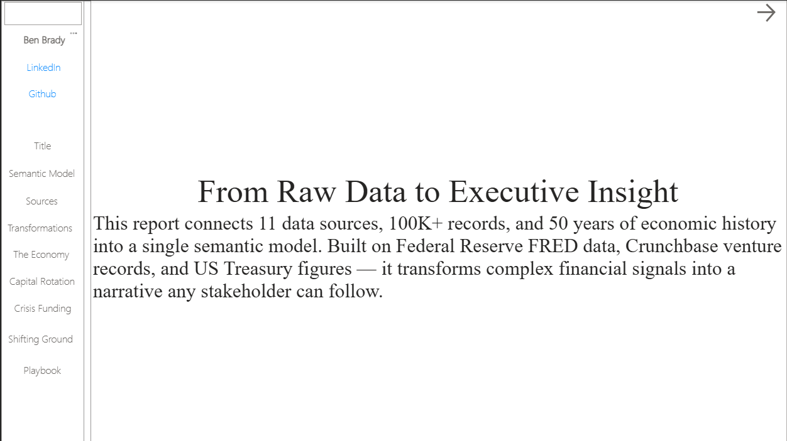

**Semantic Model** — a three-layer Fabric warehouse (staging → intermediate → mart) feeding a Power BI semantic model, with Power BI reading from the mart layer only.
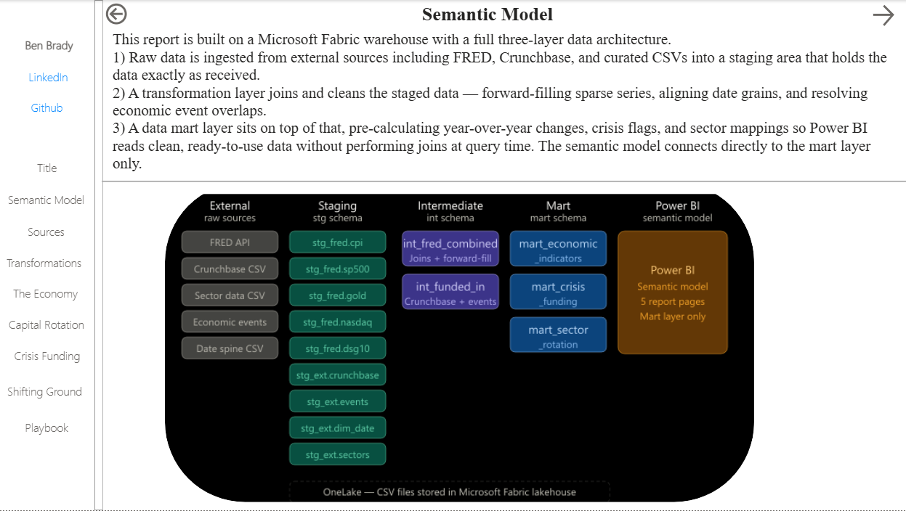

**Ingestion & Transformation** — three distinct ingestion patterns (Data Factory, Dataflow Gen2, OPENROWSET) landing in a staged, cleaned, and business-ready warehouse.
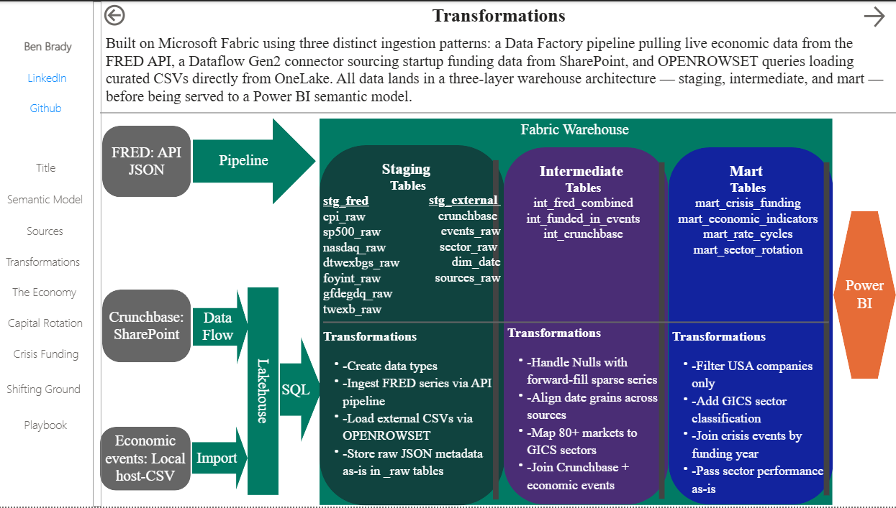

**50 Years of Rate Cycles** — tracing S&P 500, NASDAQ, and gold performance through every Federal Reserve rate cycle since the 1970s.
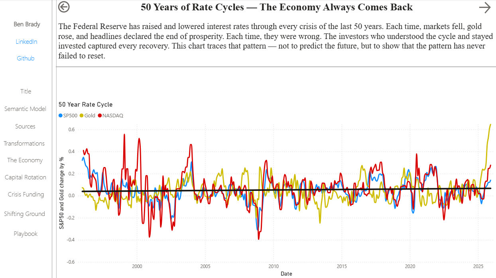

**Sector Rotation During Crises** — grounded in peer-reviewed research (Sarwar, Mateus & Todorovic 2017; Fidelity AART 2021), showing which GICS sectors outperform during economic downturns.
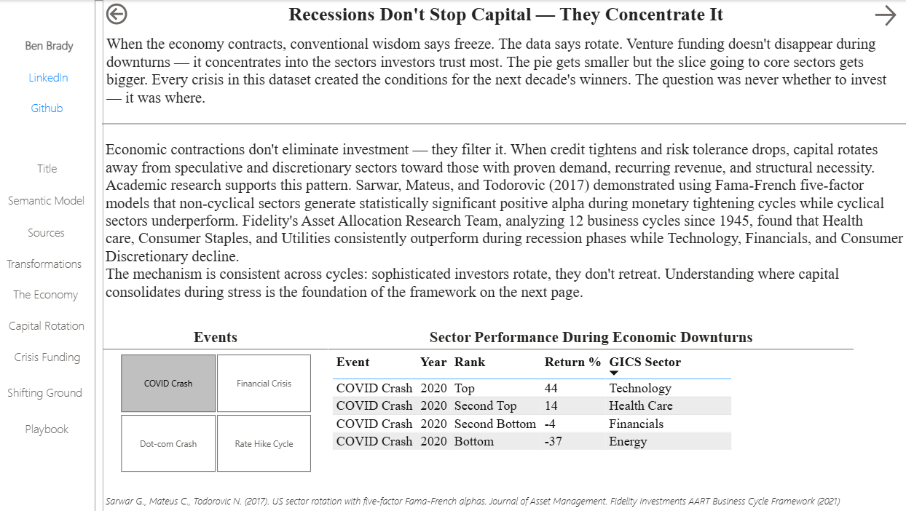
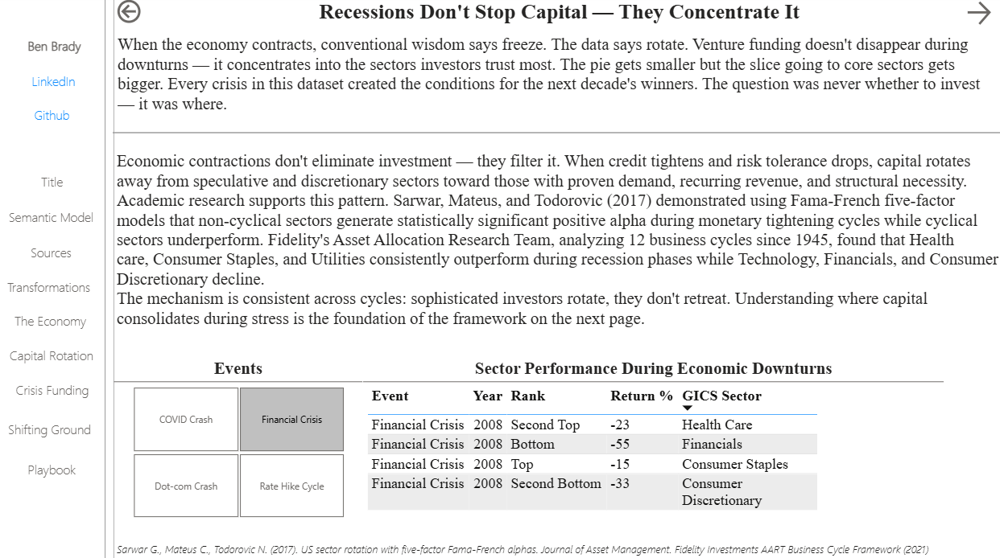

**Crisis-Era Company Funding** — drill-through by crisis event, showing first-round VC funding by sector and company outcome.
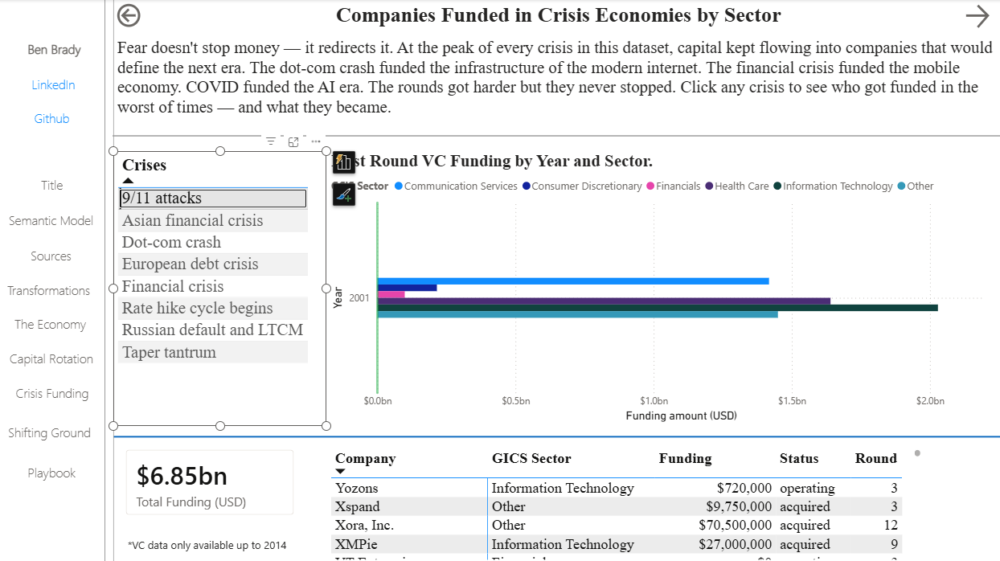
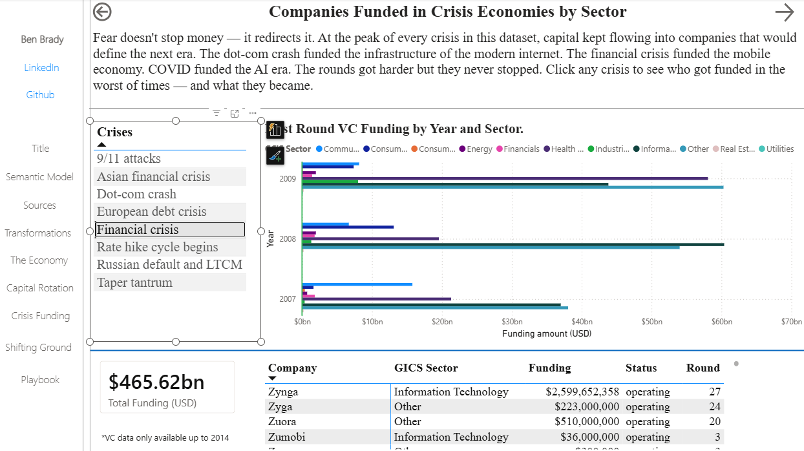

**Shifting Ground** — rising federal interest costs and the dollar/gold divergence as a signal of ongoing capital rotation.
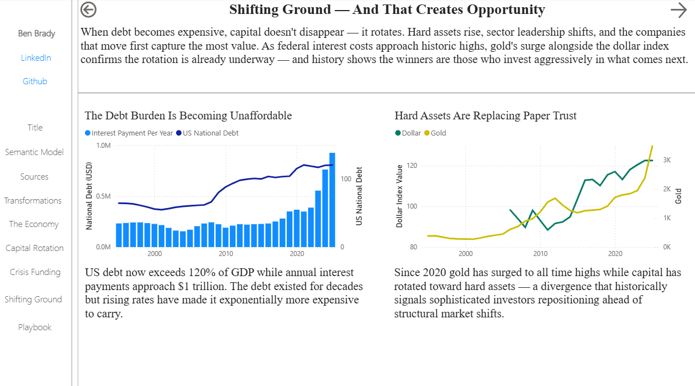

**The Playbook** — a structural long/short sector framework derived from the underlying data patterns. *Analytical framework for discussion purposes only; not investment advice.*
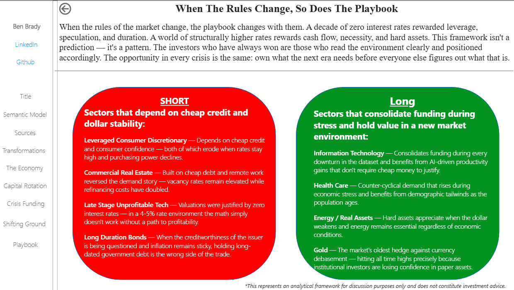

---

## The Business Question

When debt becomes expensive, capital doesn't disappear — it rotates. Hard assets rise, sector leadership shifts, and the companies that move first capture the most value. This project connects 50 years of Federal Reserve economic data to startup funding patterns during crisis periods to answer: **where does capital go when conditions change, and who wins?**

---

## Architecture

[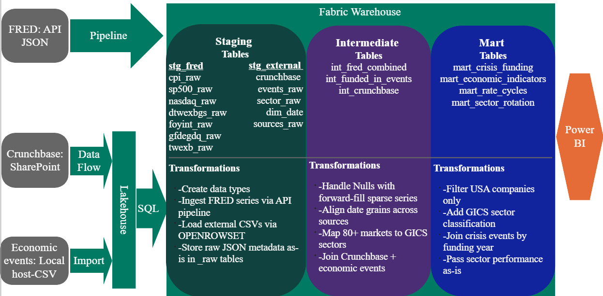](macro-market-analysis/images/transformations.png)

### Three Ingestion Patterns

| Pattern    | Source               | Method                          | Destination               |
| ---------- | --------------------- | -------------------------------- | -------------------------- |
| Live API   | FRED (St. Louis Fed)  | Data Factory Pipeline            | `stg_fred.*_raw`           |
| SharePoint | Crunchbase CSV        | Dataflow Gen2 → Lakehouse → SQL  | `stg_external.crunchbase`  |
| OneLake    | Curated CSVs          | OPENROWSET                       | `stg_external.*`           |

### Three-Layer Warehouse

```
stg_fred / stg_external    →    int    →    mart    →    Power BI
    Raw ingestion              Clean        Business       Semantic
    No transformation          Type          Ready          Model
                               Join
                              Forward-fill
```

---

## Data Sources

| Series                             | Source               | Description                                                   |
| ----------------------------------- | --------------------- | --------------------------------------------------------------- |
| CPI (CPIAUCSL)                      | FRED / St. Louis Fed  | Consumer Price Index — monthly inflation measure               |
| 10-Year Treasury (DGS10)            | FRED / St. Louis Fed  | 10-year interest rate — benchmark for capital cost              |
| S&P 500 (SP500)                     | FRED / St. Louis Fed  | Monthly S&P 500 index value                                     |
| NASDAQ (NASDAQCOM)                  | FRED / St. Louis Fed  | NASDAQ Composite index                                          |
| Dollar Index (DTWEXBGS)             | FRED / St. Louis Fed  | Broad dollar index — currency strength signal                   |
| Federal Interest Payments (FYOINT)  | FRED / US Treasury    | Annual federal debt service cost                                 |
| Debt to GDP (GFDEGDQ188S)           | FRED / St. Louis Fed  | Federal debt as % of GDP — structural debt burden                |
| Gold                                 | Static CSV             | 100-year gold price history                                      |
| Crunchbase                           | Kaggle / Crunchbase    | 54,000+ US startup companies with funding history (1990–2014)    |
| Economic Events                      | Curated manually       | 19 major economic events from 1971–2024                          |
| Sector Performance                   | Curated manually       | Annual GICS sector returns during economic events                 |

---

## Key Transformations

### Intermediate Layer

**`int_fred_combined`**
- Joins all FRED series on a monthly date spine
- Forward-fills sparse values using `LAST_VALUE ... IGNORE NULLS` window function
- Aligns quarterly (FYOINT) and annual series to monthly grain using `YEAR()` and `DATEPART(QUARTER, ...)`
- Casts all `VARCHAR` date and value columns from raw JSON to `FLOAT` and `DATE` using `TRY_CAST`

**`int_crunchbase`**
- Trims whitespace from the `market` column
- Maps 80+ Crunchbase market categories to 11 GICS sectors via `CASE WHEN`
- Preserves all source columns for downstream mart flexibility

**`int_funded_in_events`**
- Joins Crunchbase companies to economic events by funding year

### Mart Layer

**`mart_crisis_funding`**
- Filters to USA companies only
- Joins funded companies to crisis events by year
- Exposes GICS sector classification for cross-filtering in Power BI

**`mart_sector_rotation`**
- Passes sector performance data through as-is for BI consumption

---

## Notable Engineering Decisions

**Why forward-fill?** FRED series report at different frequencies — CPI is monthly, FYOINT is quarterly, debt-to-GDP is quarterly. Rather than leave NULLs in the combined view, `LAST_VALUE IGNORE NULLS` carries the most recent known value forward, which is analytically correct for these slowly-changing economic indicators.

**Why separate staging and int layers?** The FRED API pipeline lands raw JSON metadata alongside the actual `date` and `value` columns. Staging preserves everything as received. The int layer selects only what matters, casts types, and joins — keeping the transformation logic in one auditable place.

**Why connect Power BI to mart only?** The mart layer is the contract between engineering and the business layer. Power BI never joins, never transforms, never filters at query time — it reads clean, pre-aggregated data. This keeps report performance fast and logic centralised in SQL where it belongs.

**DGS10 fallback** The DGS10 series intermittently returns HTTP 500 from the FRED API. Rather than block the pipeline, DGS10 falls back to a static OneLake CSV (`stg_fred.dgs10`). The commented pipeline version in `int_fred_combined` can replace it once the API stabilises. This is noted in the SQL.

---

## Repo Structure

```
macro-market-analysis/
├── sql/
│   └── market_analysis.sql       # Complete warehouse build script
├── images/
│   ├── 01_title.png    # Report title page
│   ├── 02_semantic_model.png
│   ├── 03_transformations.png
│   ├── 04_rate_cycles.png
│   ├── 05_capital_rotation_covid.png
│   ├── 06_capital_rotation_financial_crisis.png
│   ├── 07_crisis_funding_dotcom.png
│   ├── 08_crisis_funding_financial.png
│   ├── 09_shifting_ground.png
│   ├── 10_playbook.png
│   ├── transformations.png       # Architecture + transformation diagram
│   └── data_lineage.svg          # Data lineage SVG
└── README.md
```

---

## Tech Stack

- **Microsoft Fabric** — Warehouse, Lakehouse, OneLake
- **Azure Data Factory** (Fabric) — FRED API pipeline
- **Dataflow Gen2** — SharePoint ingestion
- **T-SQL** — All transformation and mart logic
- **Power BI** — Semantic model and reporting layer
- **FRED API** — St. Louis Federal Reserve economic data

---

## Author

**Benjamin Brady** | Analytics & Data Engineer
[LinkedIn](https://www.linkedin.com/in/benbrady-52935210b) | [Portfolio](https://app.powerbi.com/view?r=eyJrIjoiMTY0NWY3ZTItOTUzZi00NzIyLThhYmQtMGFmMGQzY2RhZTU4IiwidCI6IjhjZDQ5Yzc0LWNiZjctNDcyMy1hYmMzLTFhN2QzYmRjZDNhMSIsImMiOjF9)
